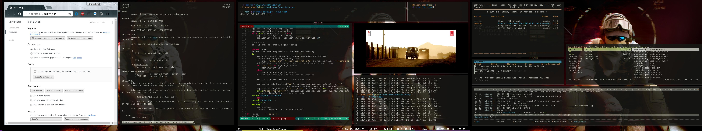

AWESOME-DOTS
============

A collection of all my config files so that I dont end up writing them all over
again :P

* Window Manager - bspwm
* Editor         - vim
* Terminal       - termite
* IRC Client     - weechat
* GTK Theme      - zukwito
* Icon Theme     - faenza
* Cursor Theme   - ecliz
* Music Player   - mpd/ncmpcpp
* Video Player   - mpv

SCREENSHOTS
-----------

