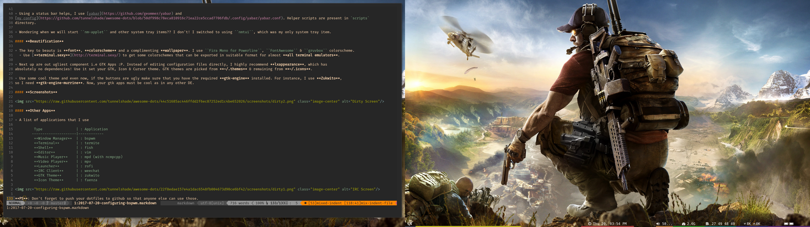

AWESOME_DOTS
============

A collection of all my config files so that I dont end up writing them all over 
again :P

Window Manager - Awesome
Theme          - Zenburn Tweaked (Included)
Editor         - Vim
Terminal       - rxvt-unicode
IRC Client     - irssi
GTK Theme      - Blackbird
Icon Theme     - Faenza
Cursor Theme   - Ecliz

SCREENSHOTS
-----------

Clean

Dirty

