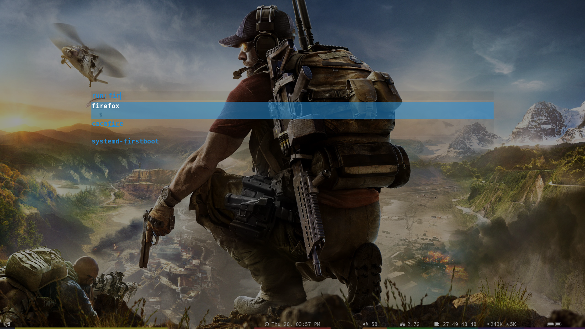
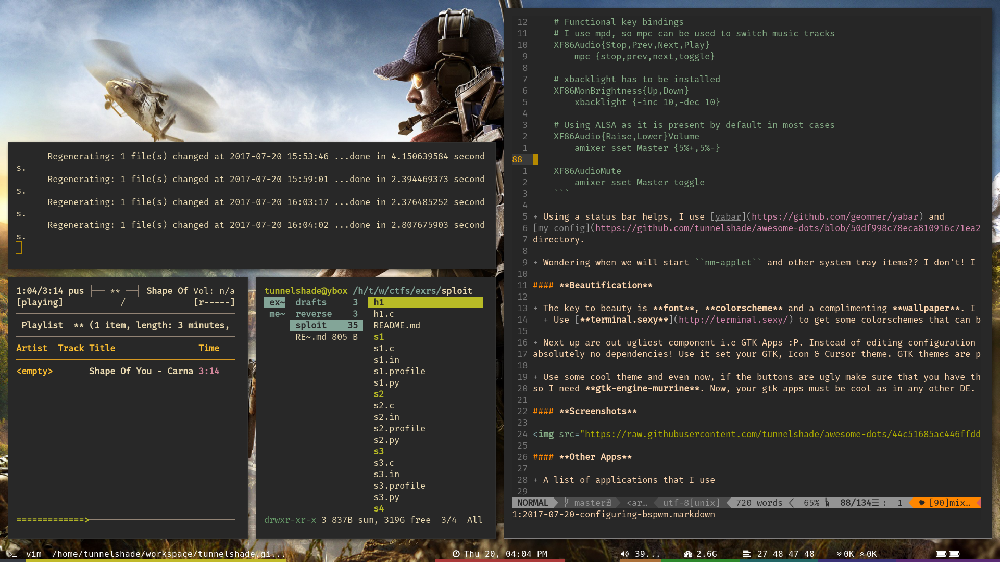

AWESOME-DOTS
============

A collection of all my config files so that I dont end up writing them all over 
again :P

* Window Manager - i3
* Editor         - GVim
* Terminal       - terminator
* IRC Client     - weechat
* GTK Theme      - Zukwito
* Icon Theme     - Faenza
* Cursor Theme   - Ecliz
* Music Player   - Cmus
* Video Player   - Mplayer

SCREENSHOTS
-----------

Clean

Dirty

